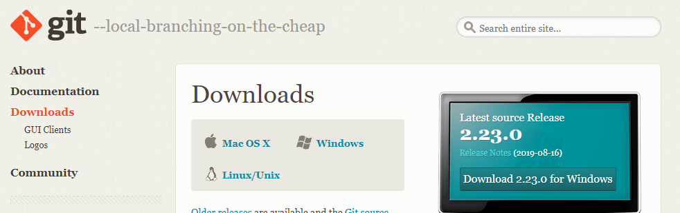
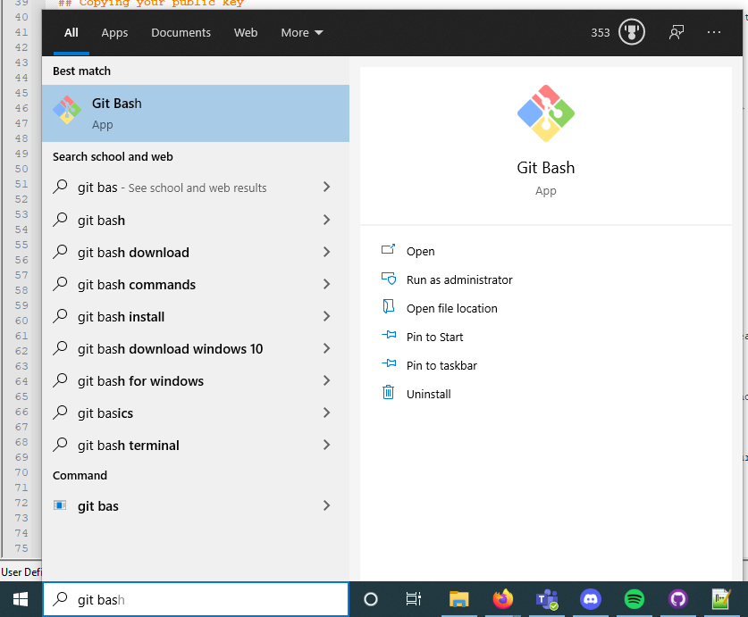
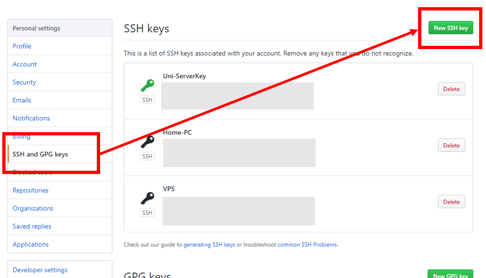
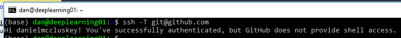
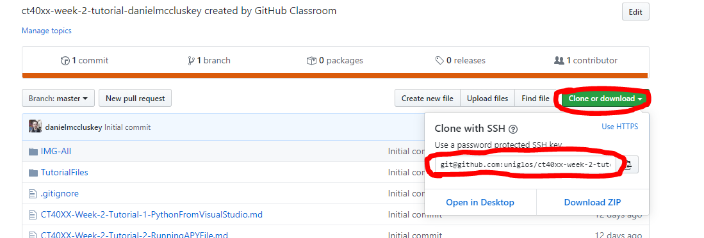

# Setting up Git for use on the Command line
This guide will give a brief overview of how to download and use Git on the command line, which is useful for controlling versions of your working directories on servers etc.

## Download Git for Windows

1. Browse to the official Git website: https://git-scm.com/downloads



## Open Git Bash
Once installed you can open Git Bash from the windows start menu




## Account Setup
Once you have installed Git on your device, you will need to configure your GitHub settings so that you can access your repositories and push commits to them.

When you have opened Git Bash you will need to type the following, filling in your GitHub details in place of `YOUR NAME` and `YOUR EMAIL` etc.

```bash
git config --global user.name "YOUR USERNAME"
```
and 
```bash
git config --global user.email "YOUR EMAIL"
```

## Generating your Keys
You will now need to setup an ssh key so that you can securely connect to GitHub's servers.
First check that you haven't already got an SSH Keypair by going to `C:\Users\YOURACCOUNT\.ssh`. If this folder exists AND it contains an `id_rsa` file and a `id_rsa.pub` file, then you can skip the next step about generating one.

Generate a keypair using the following commands:

    ssh-keygen -t rsa -C "YOUR EMAIL"

You then need to copy the contents of your public key (`id_rsa.pub`) file and add it to your GitHub settings, you can do this by right clicking `id_rsa.pub` and opening it with notepad.

- Go to your github Account Settings.
- Click `SSH Keys`.
- Click `Add SSH Key`.
- Add a decriptive name, so that you can recognise where each key is being used



You will then need to test that you have done everything correctly by using the following command:
    
    ssh -T git@github.com

If you get something along the lines of the line below, then you have successfully connected your account to GitHub, you are now ready to use Git on the command line!



## Getting to the right folder
Next we need to navigate to where we want to pull the repository to. 

We will have to use the `cd` command to **C**hange **D**irectory, to our github folder. Type in the following command, but replace the directory with your own.

```bash
cd C:\Users\Dan\Documents\GitHub
```

## Cloning your tutorial repository 
You can now clone you tutorial repository that was generated from GitHub Classrooms:

- Go to the Repository page on Github
- Click on Download
- Click Download via SSH
- Copy the contents of the text box
- Type the following command, replacing `YOURREPOSITORY` with the text you just copied!



```bash
git clone YOURREPOSITORY
```

## Jupyter Notebook
Move onto the next tutorial which contains some Python Exercises!
