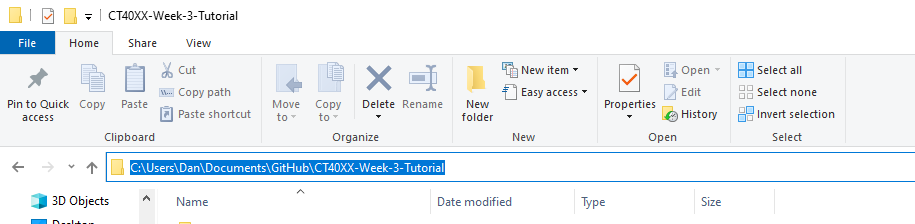

# Saving your work
This tutorial will go through how to commit your work to GitHub via the command line.

## Open Git Bash again
Open the Git Bash command window again so we can start to commit our work.

## Moving to our Repository Directory
Next we will have to use the `cd` command to **C**hange **D**irectory, to our github repository that we cloned earlier. Type in the following command, but replace the directory with your own.

```bash
cd C:\Users\Dan\Documents\GitHub\CT40XX-Week-3-Tutorial
```

To get the path, you can just copy the one from Windows explorer



## Adding files to the staging area
Next we need to add files to our staging area, so that GitHub knows to commit them when we run the commit command. The basic syntax for this command is as follows:

```bash
git add <file/directory>
```

We can just run the following to add the entire directory to the staging area:

```bash
git add .
```

## Committing
Then we can commit our work!

```bash 
git commit -m "Completed Tutorial Exercise!"
```

## Pushing
Then finally we can push our work to GitHub!

```bash
git push
```
